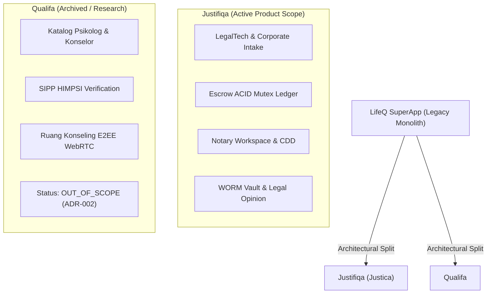

# Justifiqa (f.k.a. Justica) · Enterprise LegalTech Platform

[](https://www.typescriptlang.org/)
[](https://react.dev/)
[](https://tailwindcss.com/)
[](https://supabase.com/)
[](https://deno.land/)
[]()
[]()
[](https://github.com/tupperwureism)

> **Platform LegalTech & Notary Workspace Terintegrasi** dengan jaminan kepatuhan regulasi Indonesia, audit trail nir-ubah (*WORM vault*), isolasi keamanan multi-penyewa berbasis PostgreSQL RLS, serta transaksi escrow bergaransi ACID mutex.

---

## 📌 Daftar Isi
1. [Tentang Proyek](#-tentang-proyek)
2. [Silsilah Arsitektur: Justifiqa & Qualifa](#-silsilah-arsitektur-justifiqa--qualifa)
3. [Pilar Arsitektur & Keamanan](#-pilar-arsitektur--keamanan)
4. [Tech Stack](#-tech-stack)
5. [Fitur Utama per Persona](#-fitur-utama-per-persona)
6. [Struktur Repositori](#-struktur-repositori)
7. [Panduan Instalasi & Menjalankan Proyek](#-panduan-instalasi--menjalankan-proyek)
8. [Verifikasi Kualitas & Test Suite](#-verifikasi-kualitas--test-suite)
9. [Status Pengembangan & Batasan (Honesty Boundary)](#-status-pengembangan--batasan-honesty-boundary)
10. [Creator & Lead System Architect](#-creator--lead-system-architect)

---

## 🏛 Tentang Proyek

**Justifiqa** (sebelumnya dirancang dengan nama sandi **Justica** pada fase evolusi *LifeQ SuperApp*) adalah sistem operasi hukum enterprise yang menjembatani **Klien Korporat/Individu**, **Advokat Berlisensi (PERADI)**, dan **Kantor Notaris/PPAT**.

Platform ini memecahkan inefisiensi, kerawanan sengketa pembayaran, dan pemalsuan dokumen hukum di Indonesia dengan menghadirkan:
- **Corporate Concierge:** Pengadaan akta pendirian, izin usaha OSS-RBA, dan verifikasi identitas Pemilik Manfaat (*Beneficial Ownership* / BO).
- **Escrow Settlement:** Rekening penampungan dana aman dengan kunci baris atomik (*Row-Level Mutex*) mencegah penarikan ganda (*double-spending*).
- **Notary Workspace:** Pemeriksaan *Customer Due Diligence* (CDD), verifikasi bukti korporasi, dan kepatuhan terhadap pelaporan Kemenkumham AHU.
- **WORM Audit Ledger:** Seluruh riwayat transaksi, unggahan alat bukti, dan perubahan status tersimpan di tabel *Write-Once-Read-Many* yang kedap manipulasi.

---

## 🧬 Silsilah Arsitektur: Justifiqa & Qualifa

Secara historis, repositori ini berakar dari inisiatif monolitik **LifeQ SuperApp** yang berencana menggabungkan layanan **Hukum (Legal)** dan **Kesehatan Mental (Psikologi)** dalam satu gerbang.



### Keputusan Pemisahan (ADR-002):
1. **Divergensi Regulasi yang Ekstrem:** Layanan hukum tunduk pada UU Advokat & UU Jabatan Notaris (dengan standar rahasia profesi dan pengawasan Kemenkumham), sedangkan psikologi tunduk pada Kode Etik HIMPSI & regulasi Kemenkes. Menggabungkan model data keduanya menciptakan beban kepatuhan yang berlebihan (*compliance bloat*).
2. **Justifiqa sebagai Scope Aktif:** Sesuai keputusan kanonik [`ADR-002`](MarkDown/ADR/ADR-002-justifiqa-active-product-scope.md), pengembangan aktif, Definition of Done (DoD), suite pengujian, dan target delivery saat ini **100% difokuskan pada Justifiqa**.
3. **Status Qualifa:** Artefak Qualifa (mockup UI di `Mockups/Qualifa/`, skrip bundle, dan diagram use case/sequence SD-Q) dipertahankan di repositori sebagai arsip riset historis dengan status **`OUT_OF_SCOPE`**.

---

## 🛡 Pilar Arsitektur & Keamanan

Justifiqa dibangun di atas empat disiplin rekayasa perangkat lunak ketat:

### 1. Pola Boundary-Control-Entity (BCE)
Lapisan antarmuka pengguna (*Boundary*) tidak pernah melakukan mutasi langsung ke tabel basis data. Seluruh logika transaksi diarahkan melalui *Control layer* (Supabase Deno Edge Functions atau PL/pgSQL Stored Procedures) yang memvalidasi integritas data (*Entity*).

### 2. ACID Row Mutex & Anti-Replay
Pencegahan *race condition* dan eksekusi ganda pada konfirmasi pembayaran escrow dijamin melalui `SELECT ... FOR UPDATE` level baris database yang dipadukan dengan *Idempotency Keys* unik (SHA-256).

### 3. WORM (Write Once, Read Many) Vault
Tabel ledger keuangan, riwayat stempel dokumen, dan event log audit dilengkapi trigger pembatas yang menolak instruksi `UPDATE` maupun `DELETE` dari peran apa pun, menjamin integritas forensik bukti digital.

### 4. Zero-Trust Row Level Security (RLS)
Setiap kueri PostgreSQL diikat ke token autentikasi Supabase GoTrue dengan evaluasi peran ketat (`corporate_client`, `notary`, `advocate`, `system_admin`).

---

## 💻 Tech Stack

| Layer | Komponen / Teknologi | Keterangan |
|---|---|---|
| **Frontend Framework** | React 19.2.7 + TypeScript 6.0 | Single Page Application berperforma tinggi |
| **Build & Tooling** | Vite 8.1.1 + Oxlint | Bundle kilat dan linter native Rust |
| **Styling & UI Primitives** | Tailwind CSS v4 + Radix UI | Desain modular dengan aksesibilitas standar WAI-ARIA |
| **Icons & Typography** | Lucide React + Plus Jakarta Sans | Sistem desain modern, bersih, dan enterprise |
| **Backend & Database** | Supabase (PostgreSQL 15+) | PostgREST, Auth GoTrue, Realtime WebSocket |
| **Serverless Runtime** | Deno TypeScript Edge Functions | Handler webhook, sweeper cron TTL, dan intake controller |
| **Testing** | Node.js Native Runner (`node --test`) | Zero external test dependencies, eksekusi super cepat |

---

## 👥 Fitur Utama per Persona

### 🏢 Klien Korporat (`corporate_client`)
- **Corporate Intake Wizard:** Formulir pengajuan legalitas bertahap dengan kalkulasi katalog harga dinamis.
- **Beneficial Owner (BO) Declarations:** Input susunan direksi, komisaris, dan pemegang saham pengendali beserta unggahan KTP/NPWP.
- **Escrow Settlement Dashboard:** Pelacakan status pembayaran terpadu (*PENDING*, *HOLD*, *RELEASED*, *REFUNDED*).

### ⚖️ Advokat (`advocate`)
- **Konsultasi Hukum On-Demand:** Manajemen jadwal dan integrasi ruang konsultasi dengan *Fair Clock SLA*.
- **Penerbitan Legal Opinion (LO):** Pembuatan kajian hukum berstruktur dengan penyegelan bukti digital.
- **Advocate Wallet:** Penarikan fee jasa hukum setelah konfirmasi penyelesaian oleh klien.

### 📜 Notaris Workspace (`notary`)
- **Review & Verifikasi CDD:** Panel kerja notaris untuk menyetujui atau menolak permohonan akta korporasi.
- **Pemeriksaan Dokumen Korporasi:** Validasi berkas legalitas pendukung dengan pelacakan status multi-tahap.
- **Log Idempotensi Kerja:** Setiap aksi penandatanganan dan persetujuan diikat pada tiket ber-idempotency aman.

---

## 📂 Struktur Repositori

```text
├── justifiqa-frontend/         # Kode sumber aplikasi frontend (React 19 + Vite)
│   ├── src/
│   │   ├── components/         # Komponen UI modular (client, notary, advocate, ui)
│   │   ├── hooks/              # Custom hooks berstatus single-flight & fail-closed
│   │   ├── services/           # Gateway adapter dan mapper kontrak backend
│   │   └── types/              # Type definitions TypeScript
│   └── test/                   # Behavioral test suite native Node.js
├── supabase/                   # Konfigurasi Backend & Database BaaS
│   ├── functions/              # Edge Functions berbasis Deno (corporate-intake, payment-webhook, dll)
│   ├── migrations/             # 32 berkas migrasi SQL (DDL, RLS policies, PL/pgSQL RPCs)
│   └── seed.sql                # Data awalan untuk lingkungan lokal
├── MarkDown/                   # Dokumentasi Resmi & Kontrol Proyek
│   ├── ADR/                    # Architectural Decision Records (ADR-001 s/d ADR-005)
│   ├── Batches/                # Dokumentasi per batch implementasi (3.A, 3.B, 3.C)
│   ├── CURRENT_STATE.md        # Snapshot status kanonik proyek
│   └── SYMBOLS_MAP.md          # Indeks peta simbol dan dependensi file
├── Mockups/                    # Desain antarmuka & wireframe HTML (Justifiqa & Qualifa archive)
└── Tools/                      # Skrip utilitas audit, generator peta simbol, dan probe konkurensi
```

---

## 🚀 Panduan Instalasi & Menjalankan Proyek

### Prasyarat
- **Node.js:** Versi >= 20.x (disarankan v22+ atau v24 LTS).
- **WSL2 (Windows Subsystem for Linux):** Distro Ubuntu-22.04 dengan Docker Engine CE terpasang.

### 1. Menjalankan Frontend
```powershell
# Masuk ke direktori frontend
cd justifiqa-frontend

# Pasang dependensi
npm install

# Jalankan server pengembangan
npm run dev
```
Aplikasi web akan aktif di `http://localhost:5173`.

### 2. Menjalankan Backend Supabase (via Ubuntu WSL2)
```bash
# Buka sesi Ubuntu WSL2
wsl -d Ubuntu-22.04

# Masuk ke folder proyek
cd /mnt/d/justificadll

# Nyalakan stack kontainer Supabase (Database, Auth, Storage, Edge Runtime)
npx supabase start
```

---

## 🧪 Verifikasi Kualitas & Test Suite

Repository ini menganut disiplin verifikasi ketat tanpa kompromi (*zero tolerance for false-greens*):

```powershell
# Jalankan seluruh suite tes behavioral Phase 2 (129 pengujian)
npm --prefix justifiqa-frontend run test:phase2

# Jalankan pemeriksaan tipe TypeScript pada suite pengujian
npm --prefix justifiqa-frontend run typecheck:phase2-tests

# Jalankan linter cepat Oxlint
npm --prefix justifiqa-frontend run lint

# Verifikasi konsistensi peta simbol ekspor
node Tools/generate_symbol_map.mjs --check
```

---

## ⚖️ Status Pengembangan & Batasan (Honesty Boundary)

Sesuai prinsip kejujuran rekayasa teknis:
- **Status Kanonik Saat Ini:** **`ACCEPTED_LOCAL`** (Lulus audit komprehensif 360° pada lingkungan lokal).
- **Integrasi Live Gateway:** Penyedia pembayaran (Midtrans) dan verifikasi identitas e-KYC/Tanda Tangan Digital (Privy/Peruri) berjalan menggunakan **mock gateway simulasi lokal** (`BLOCKED_BY_PROVIDER_SELECTION`). Arsitektur webhook, verifikasi signature kriptografis, dan alur idempotensi telah selesai diuji dan siap dihubungkan dengan API key produksi.
- **Arsip Qualifa:** Komponen Qualifa berstatus **`OUT_OF_SCOPE`** dan tidak menghalangi rilis atau audit Justifiqa.

---

## 👑 Creator & Lead System Architect

Proyek ini dikonsep, dirancang arsitekturnya, dan dibangun pertama kali oleh:

- **Shalom Kurniawan** ([@tupperwureism](https://github.com/tupperwureism))
  - **Peran:** Founding Creator, Lead System Architect & Protocol Designer
  - **Kontak:** [trusukkendal@gmail.com](mailto:trusukkendal@gmail.com)
  - **Karya Inti:** Perancangan arsitektur BCE, WORM Audit Vault, ACID Row-Mutex Escrow, dan Spesifikasi Kepatuhan Notary Workspace.

---
*Dikelola dengan standar ketat rekayasa perangkat lunak Justifiqa Core Engineering.*
